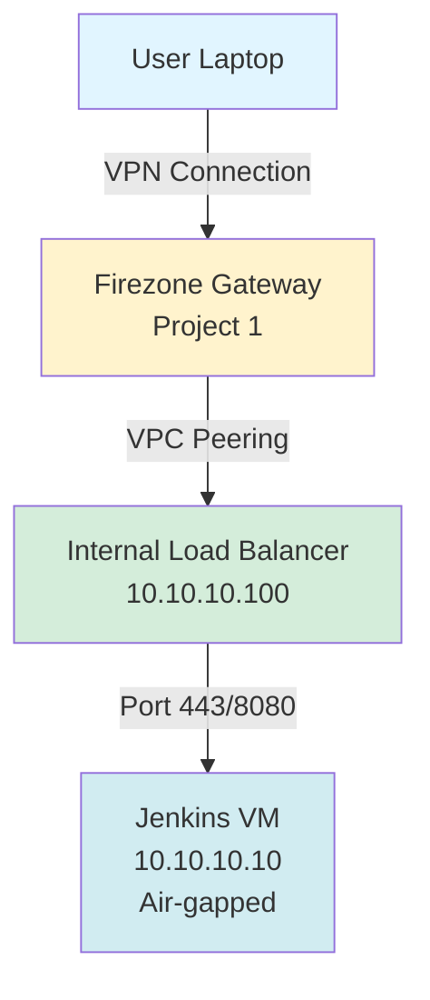

# Jenkins VPN Infrastructure Documentation

!!! success "Status: Production Ready"
    Your secure Jenkins infrastructure is fully operational with complete PKI, HTTPS, and 5-layer security architecture.

## 🎯 Project Overview

A production-ready, enterprise-grade Jenkins CI/CD infrastructure with:

- ✅ **Zero Internet Exposure** - Air-gapped Jenkins VM with no public IP
- ✅ **VPN-Only Access** - Firezone WireGuard VPN authentication required
- ✅ **Complete PKI** - 3-tier certificate chain (Root → Intermediate → Server)
- ✅ **HTTPS Encryption** - Full TLS with certificate validation
- ✅ **5-Layer Security** - Network isolation, VPN auth, firewall, VPN encryption, TLS encryption
- ✅ **Cost Optimized** - $58.87/month (52% cheaper than Cloud NAT approach)

## 🚀 Quick Links

-   :material-rocket-launch:{ .lg .middle } __Quick Start__

    ---

    Get started in 5 minutes with our quick access guide

    [:octicons-arrow-right-24: Quick Access Guide](quick-access.md)

-   :material-security:{ .lg .middle } __Security__

    ---

    Learn about our 5-layer security architecture

    [:octicons-arrow-right-24: Security Layers](diagrams/05-SECURITY-LAYERS.md)

-   :material-certificate:{ .lg .middle } __PKI Setup__

    ---

    Complete PKI certificate chain implementation

    [:octicons-arrow-right-24: PKI Guide](PKI-QUICK-START.md)

-   :material-web:{ .lg .middle } __HTTPS Access__

    ---

    Configure HTTPS access to Jenkins

    [:octicons-arrow-right-24: HTTPS Setup](ACCESS-JENKINS-HTTPS.md)

## 📊 Infrastructure Status

| Component | Status | Details |
|-----------|--------|---------|
| Infrastructure Health | ✅ 100% | All systems operational |
| Security Rating | ⭐⭐⭐⭐⭐ | 5/5 layers active |
| Monthly Cost | $58.87 | Optimized |
| Certificate Validity | 365 days | Valid until Feb 2027 |

## 🌐 Access URLs

!!! info "Primary Access"
    **HTTPS:** `https://jenkins.np.learningmyway.space`
    
    - ✅ Full certificate validation
    - ✅ Browser shows "Secure" 🔒
    - ✅ No warnings

!!! tip "Alternative Access"
    **Direct IP:** `https://10.10.10.100`
    
    - ✅ Works via IP address
    - ⚠️ May show certificate name mismatch (expected)

## 🏗️ Architecture

## 📚 Documentation Sections

### Getting Started
- [Quick Start Guide](START-HERE.md) - Get up and running in minutes
- [Current Status](CURRENT-STATUS.md) - Infrastructure health and status
- [Quick Reference](QUICK-REFERENCE-CARD.md) - One-page reference card

### Architecture & Design
- [Infrastructure Architecture](diagrams/01-INFRASTRUCTURE-ARCHITECTURE.md) - Complete system design
- [PKI Architecture](diagrams/02-PKI-CERTIFICATE-ARCHITECTURE.md) - Certificate chain hierarchy
- [Security Layers](diagrams/05-SECURITY-LAYERS.md) - Defense-in-depth model

### Implementation
- [PKI Setup Guide](PKI-CERTIFICATE-CHAIN-GUIDE.md) - Complete PKI implementation
- [HTTPS Configuration](ACCESS-JENKINS-HTTPS.md) - HTTPS access setup
- [Firezone Setup](FIREZONE-RESOURCE-SETUP.md) - VPN configuration

### Operations
- [Final Status Report](FINAL-STATUS-REPORT.md) - Complete project status
- [Session Summary](SESSION-SUMMARY.md) - Implementation overview
- [Cleanup Guide](CLEANUP-COMPLETE.md) - Infrastructure cleanup

## 🔐 Security Highlights

### 5-Layer Security Architecture

1. **Network Isolation** - No public IP on Jenkins VM
2. **VPN Authentication** - Firezone WireGuard VPN required
3. **Firewall Protection** - Strict access control rules
4. **VPN Encryption** - All traffic encrypted in transit
5. **TLS Encryption** - HTTPS with full certificate chain

!!! success "Security Rating: Maximum"
    This infrastructure implements industry best practices for secure CI/CD deployments.

## 💰 Cost Summary

| Component | Monthly Cost |
|-----------|--------------|
| Jenkins VM (e2-medium) | $24.27 |
| Firezone VM (e2-small) | $12.14 |
| Boot Disks (2x 50GB) | $8.00 |
| Data Disk (100GB) | $10.00 |
| Static IPs (2) | $4.46 |
| **Total** | **$58.87/month** |

!!! tip "Cost Optimized"
    Saves $64/month (52%) compared to Cloud NAT approach - **$768/year savings**

## 🎯 Key Features

### Infrastructure
- Two GCP projects for network isolation
- VPC peering for secure connectivity
- Internal load balancer with health checks
- Private DNS zone for custom domain

### Security
- Air-gapped Jenkins VM (no internet access)
- VPN-only access via Firezone
- Complete 3-tier PKI infrastructure
- HTTPS with certificate validation
- Multiple firewall layers

### Certificates
- Root CA: 10-year validity
- Intermediate CA: 5-year validity
- Server Certificate: 1-year validity
- Full certificate chain validation
- Browser shows "Secure" 🔒

## 📖 Next Steps

1. **Review Architecture** - Understand the system design
2. **Configure Access** - Set up VPN and HTTPS access
3. **Verify Security** - Review security layers
4. **Set Reminders** - Certificate renewal dates

## 🆘 Need Help?

- **Quick Access Issues** - See [Troubleshooting Guide](troubleshooting.md)
- **Certificate Problems** - Check [PKI Guide](PKI-CERTIFICATE-CHAIN-GUIDE.md)
- **VPN Issues** - Review [Firezone Setup](FIREZONE-RESOURCE-SETUP.md)
- **General Questions** - See [Quick Reference](QUICK-REFERENCE-CARD.md)

---

!!! quote "Project Complete"
    You now have a production-ready, enterprise-grade, secure Jenkins infrastructure with complete PKI, HTTPS, and comprehensive documentation. 🎉
