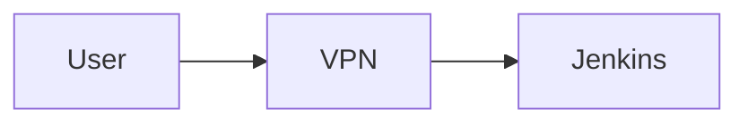

# Professional Documentation Website Setup Guide

## 🎯 What You'll Get

A beautiful, professional documentation website like this:


**Features:**
- ✅ Beautiful modern design
- ✅ Dark/light theme toggle
- ✅ Full-text search
- ✅ Mobile responsive
- ✅ Code syntax highlighting
- ✅ Automatic navigation
- ✅ Fast and lightweight

## 🚀 Quick Setup (5 Minutes)

### Step 1: Install MkDocs Material

=== "Using pip"

    ```bash
    # Install Python if not already installed
    # Download from: https://www.python.org/downloads/
    
    # Install MkDocs Material
    pip install -r requirements.txt
    ```

=== "Using pipx (Recommended)"

    ```bash
    # Install pipx first
    python -m pip install --user pipx
    python -m pipx ensurepath
    
    # Install MkDocs Material
    pipx install mkdocs-material
    ```

=== "Using conda"

    ```bash
    conda install -c conda-forge mkdocs-material
    ```

### Step 2: Serve Locally

```bash
# Start development server
mkdocs serve

# Open browser to: http://127.0.0.1:8000
```

!!! success "That's it!"
    Your documentation website is now running locally with live reload!

### Step 3: Build for Production

```bash
# Build static site
mkdocs build

# Output will be in site/ folder
```

## 📁 Project Structure

```
your-project/
├── mkdocs.yml              # Configuration file (already created)
├── requirements.txt        # Python dependencies (already created)
├── index.md               # Home page (already created)
├── quick-access.md        # Quick access guide (already created)
├── docs/                  # Additional documentation
│   └── ...
├── diagrams/              # Architecture diagrams
│   └── ...
└── site/                  # Built website (generated)
    └── ...
```

## 🌐 Deployment Options

### Option 1: GitHub Pages (Free)

```bash
# Deploy to GitHub Pages
mkdocs gh-deploy

# Your site will be at: https://username.github.io/repo-name/
```

**Setup:**
1. Push your code to GitHub
2. Run `mkdocs gh-deploy`
3. Enable GitHub Pages in repository settings
4. Done!

### Option 2: Netlify (Free)

1. Go to [Netlify](https://www.netlify.com/)
2. Connect your GitHub repository
3. Build command: `mkdocs build`
4. Publish directory: `site`
5. Deploy!

**Result:** Auto-deploys on every git push

### Option 3: Vercel (Free)

1. Go to [Vercel](https://vercel.com/)
2. Import your GitHub repository
3. Build command: `mkdocs build`
4. Output directory: `site`
5. Deploy!

### Option 4: Your Own Server

```bash
# Build the site
mkdocs build

# Copy site/ folder to your web server
scp -r site/* user@yourserver:/var/www/html/

# Or use rsync
rsync -avz site/ user@yourserver:/var/www/html/
```

### Option 5: AWS S3 + CloudFront

```bash
# Build the site
mkdocs build

# Upload to S3
aws s3 sync site/ s3://your-bucket-name/ --delete

# Invalidate CloudFront cache
aws cloudfront create-invalidation --distribution-id YOUR_DIST_ID --paths "/*"
```

## 🎨 Customization

### Change Colors

Edit `mkdocs.yml`:

```yaml
theme:
  palette:
    primary: indigo  # Change to: red, pink, purple, blue, cyan, teal, green, etc.
    accent: blue     # Change to match your brand
```

### Add Logo

```yaml
theme:
  logo: assets/logo.png
  favicon: assets/favicon.png
```

### Add Custom CSS

Create `docs/stylesheets/extra.css`:

```css
:root {
  --md-primary-fg-color: #your-color;
}
```

Add to `mkdocs.yml`:

```yaml
extra_css:
  - stylesheets/extra.css
```

### Add Analytics

```yaml
extra:
  analytics:
    provider: google
    property: G-XXXXXXXXXX
```

## 📊 Features Included

### Search

Full-text search is automatically enabled. Try it with `Ctrl+K` or `/`

### Code Highlighting

```python
def hello_world():
    print("Hello, World!")
```

### Admonitions

!!! note "This is a note"
    Important information goes here

!!! tip "Pro Tip"
    Helpful advice goes here

!!! warning "Warning"
    Caution information goes here

!!! danger "Danger"
    Critical warnings go here

### Tabs

=== "Tab 1"
    Content for tab 1

=== "Tab 2"
    Content for tab 2

### Tables

| Feature | Status |
|---------|--------|
| Search | ✅ |
| Mobile | ✅ |
| Dark Mode | ✅ |

### Diagrams (Mermaid)



## 🔧 Advanced Configuration

### Add Blog

```yaml
plugins:
  - blog:
      blog_dir: blog
```

### Add Versioning

```yaml
plugins:
  - mike:
      version_selector: true
```

### Add i18n (Multiple Languages)

```yaml
plugins:
  - i18n:
      default_language: en
      languages:
        en: English
        es: Español
```

## 📱 Mobile Preview

The site is fully responsive. Test on mobile:

```bash
# Serve on all interfaces
mkdocs serve -a 0.0.0.0:8000

# Access from phone: http://your-ip:8000
```

## 🐛 Troubleshooting

### MkDocs not found

```bash
# Check Python installation
python --version

# Check pip installation
pip --version

# Reinstall MkDocs
pip install --upgrade mkdocs-material
```

### Port already in use

```bash
# Use different port
mkdocs serve -a 127.0.0.1:8001
```

### Build errors

```bash
# Check configuration
mkdocs build --strict

# Validate config
python -m mkdocs build --config-file mkdocs.yml
```

## 📚 Resources

- [MkDocs Material Documentation](https://squidfunk.github.io/mkdocs-material/)
- [MkDocs Documentation](https://www.mkdocs.org/)
- [Markdown Guide](https://www.markdownguide.org/)
- [Material Design Icons](https://materialdesignicons.com/)

## 🎯 Next Steps

1. **Customize** - Change colors, add logo, customize theme
2. **Deploy** - Choose deployment option and go live
3. **Share** - Share your documentation URL with team
4. **Maintain** - Update documentation as infrastructure changes

## 💡 Pro Tips

1. **Use Live Reload** - Keep `mkdocs serve` running while editing
2. **Preview Before Deploy** - Always check `mkdocs build` succeeds
3. **Use Git** - Version control your documentation
4. **Add CI/CD** - Auto-deploy on git push
5. **Monitor Analytics** - Track documentation usage

## 🆘 Need Help?

- [MkDocs Material Discussions](https://github.com/squidfunk/mkdocs-material/discussions)
- [Stack Overflow](https://stackoverflow.com/questions/tagged/mkdocs)
- [MkDocs Material Sponsors](https://squidfunk.github.io/mkdocs-material/insiders/)

---

!!! success "Ready to Go!"
    Your professional documentation website is ready. Just run `mkdocs serve` and start exploring!

**Commands Summary:**

```bash
# Serve locally
mkdocs serve

# Build for production
mkdocs build

# Deploy to GitHub Pages
mkdocs gh-deploy
```

Enjoy your beautiful documentation website! 🎉
